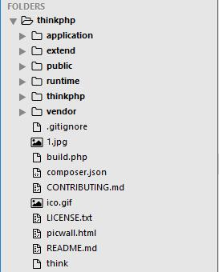
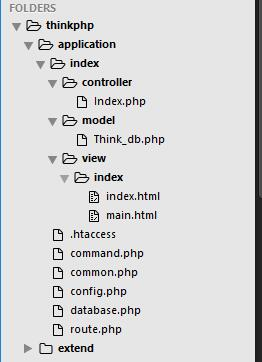

* 前期准备：数据库+网站服务器+php服务器；简单的做法是下载一个软件
：“WAMP”,百度，下载，即可。打开安装目录，找到www目录，网站文件放
在这里。mysql+php

* thinkphp是一个网站的框架，百度他，然后下载thinkphp5，
放在自己的本地，目录如下：



* V层示例：
文件目录如下：

在index.html文件中写入如下代码：

``` html
<!DOCTYPE html>
<html>
<head>
    <title>index</title>
</head>
<body>
    <form action="index/index/login" method="post">
        用户名：<input type="text" name="user" /><br/>
        密码：<input type="text" name="password"/><br/>
        <button type="submit">登录</button>
    </form>
    <a href="index/index/main">跳转</a>
</body>
</html>
```

* c层示例：
同上图目录结构，编辑Index.php文件，写入如下代码：

``` php
<?php
namespace app\index\controller;
use think\Db;
use app\index\model\Think_db;
class Index
{
    public function index()
    {
        return view('index');
    }
    public function main()
    {
        return view('main');
    }
    public function login()
    {
        $user=$_POST['user'];
        $password=$_POST['password'];
        $tdb = new Think_db();
        $select=$tdb->login($user,$password);
        if ($select="ok") {
            $_SESSION['user']=$user;
            return view ('main');
        } else {
            return view('index');
        }

    }
}

```

* M层示例：
如上结构图所示，编辑Tink_db.php文件，写入如下代码：

``` php
<?php
namespace app\index\model;
use think\Model;
class Think_db extends Model
{
    public function login($user,$password)
    {
        $select=db('user')->where('user',$user)->find();
        if ($password==$select['password']) {
            return "ok";
        } else {
            return "fail";
        }


    }
}
```

* 在浏览器访问localhost/thinkphp/public，原理如下：
此时默认访问public下的index.php，默认执行application/controller
下的index.php里面的index方法
``` php
    public function index()
    {
        return view('index');
    }
```
这个方法中view函数是默认调用视图层的index/index.html，就是上边的
V层的内容，现在打开的就是V层的那个html的内容。
点击submit之后，调用的是index模块的index.php里面的login方法，
这个方法去调用M层的函数；
M层写的函数就是纯粹的读取数据库的操作了，数据库的配置文件是那个结构
图的database.php，在里面写好你的配置即可